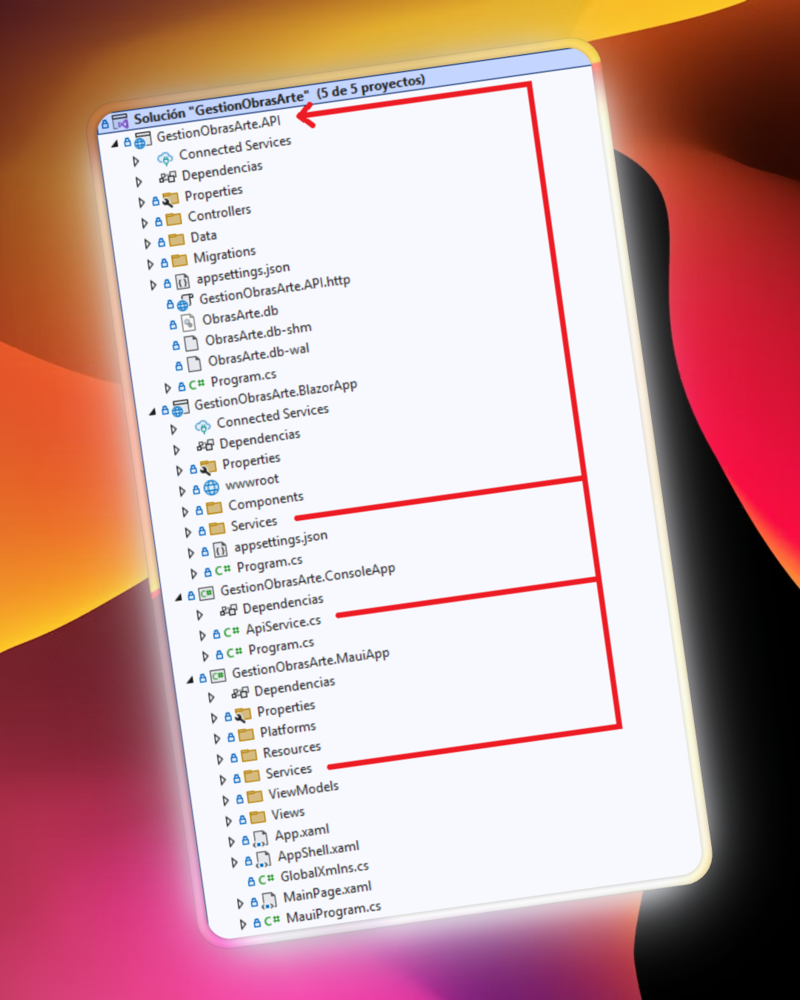
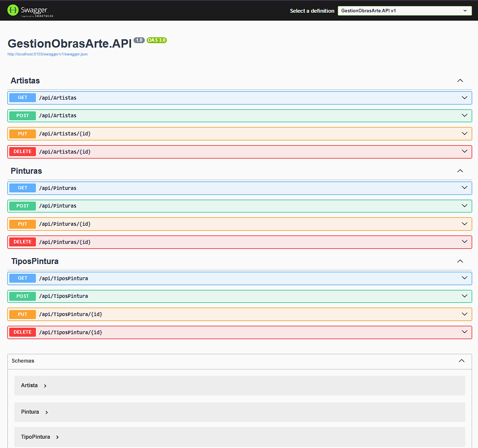
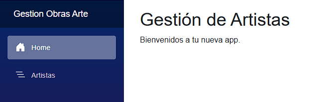
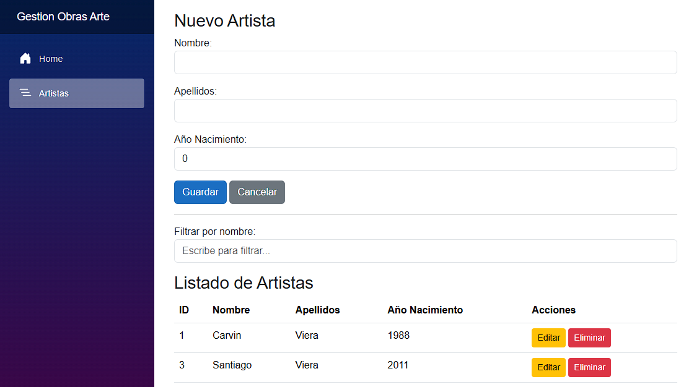
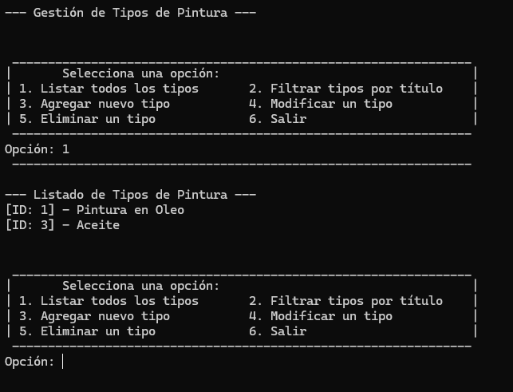
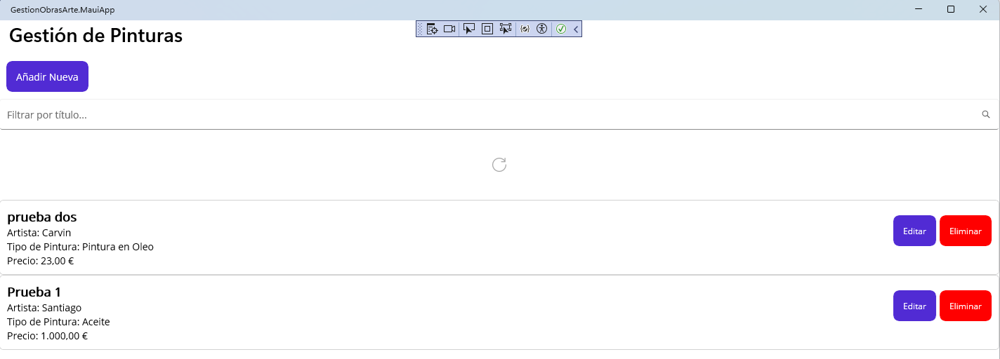
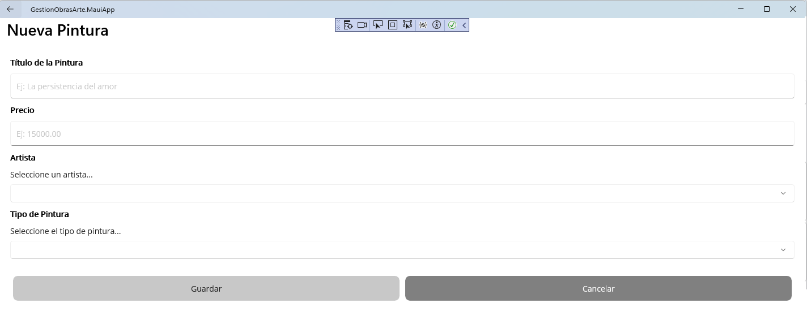

# 🎨 <a href="https://github.com/carvinviera/GestionObrasArte/"> Gestión de Obras de Arte </a>

> **Sistema integral para la administración y registro de obras de arte, artistas y tipos de pintura**, desarrollado con una arquitectura modular en .NET 9.

---

## 🧠 Objetivo del Proyecto

El objetivo principal de **Gestión de Obras de Arte** es ofrecer una solución integral que permita administrar información relacionada con obras, artistas y tipos de pintura desde distintos entornos (web, móvil, consola y API), garantizando la **consistencia de datos** y la **modularidad del desarrollo**.

---

## 🧱 Arquitectura del Proyecto



La captura de pantalla muestra la arquitectura de la solución del proyecto **"Gestión de Obras de Arte"** en Visual Studio.  
Se observa una estructura de solución (`.sln`) que contiene **cinco proyectos principales**, demostrando un enfoque de **separación de responsabilidades (SoC)** y una **arquitectura orientada a servicios** donde cada proyecto tiene su httpClient para comunicación con backend:

- **`GestionObrasArte.API`**  
  Proyecto **Backend (API REST)** desarrollado en **.NET 9**.  
  Actúa como el servidor central, manejando la lógica de negocio y la comunicación con la base de datos.

  Con pruebas de las mismas usando swagger
  Accediendo a la url del backend (configurada localmente o en su defecto si se publica) /swagger/index , en mi caso http://localhost:5103/swagger/index se puede acceder a este menú interactivo donde puedo: realizar pruebas de cada endpoint configurado y su resultado... 
  En cada uno es posible explorar los endpoints, visualizar los modelos y probar peticiones `GET`, `POST`, `PUT`, y `DELETE`.

  Abajo muestra los schemas de tabla establecidos..

  

- **`GestionObrasArte.BlazorApp`**  
  Proyecto **Frontend (Cliente Web)** basado en **Blazor Server**, diseñado para la gestión interactiva de la entidad **Artistas**.

  Menú principal dando entrada a la web, desde donde se accede al formulario de registro, edición y consulta.  

  

  Luego aquí mostramos el formulario de ingreso nuevo artista y el listado de artistas guardados, al aplicar el filtro es posible observar el cambio de los datos dando resultado a la búsqueda de manera interactiva.
  Al editar se usa visualmente mismo formulario con datos a editar y cada formularios mantienen validaciones de datos requeridos segun modelo Artistas.

  
  
- **`GestionObrasArte.ConsoleApp`**  
  Proyecto **Cliente de Consola**, enfocado en las operaciones **CRUD** de la entidad **Tipos de Pintura**.

  Aquí se muestra un menú interactivo que permite seleccionar acciones mediante números asociados a cada operación, respondiendo y modificando el ingreso de datos y resultados de acuerdo al mismo.

  

- **`GestionObrasArte.MauiApp`**  
  Proyecto **Cliente Multiplataforma (.NET MAUI)**, orientado a la gestión de **Pinturas** para **dispositivos móviles y de escritorio**.

  Similar al Proyecto de Artistas tenemos el de gestión de Pinturas donde mostramos directamente una lista de pinturas guardadas y su filtro de búsqueda. 

  

  Tambien contamos con la posibilidad de interactuar con los botones de acceso al formulario Añadir nueva y editar pintura, así como la funcionalidad de eliminar de la lista. Ambos formularios mantienen la validaciones de datos requeridos segun modelo Artistas.

  

- **`GestionObrasArte.Shared`**  
  Biblioteca de clases **compartida**, que contiene los **modelos de datos (DTOs/Entidades)** utilizados por la API y los proyectos cliente, garantizando la **consistencia de datos** en toda la solución.

---

## 🧩 Tecnologías Utilizadas

| Capa | Tecnología / Framework | Descripción |
|------|-------------------------|-------------|
| Backend | **.NET 9 Web API** | Lógica de negocio y endpoints REST |
| Frontend Web | **Blazor Server** | Interfaz interactiva para gestión de artistas |
| Frontend Móvil / Escritorio | **.NET MAUI** | Aplicación multiplataforma para gestión de pinturas |
| Cliente CLI | **.NET Console App** | Operaciones CRUD desde línea de comandos |
| Base de Datos | **PostgreSQL** | Almacenamiento principal de datos |
| Compartido | **C# DTOs / Models** | Modelos compartidos entre los proyectos |

---

## ⚙️ Estructura de Carpetas

```bash
GestionObrasArte/
│
├── GestionObrasArte.API/          # API REST (.NET 9)
├── GestionObrasArte.BlazorApp/    # Interfaz web con Blazor Server
├── GestionObrasArte.ConsoleApp/   # Cliente de consola
├── GestionObrasArte.MauiApp/      # App móvil y escritorio (MAUI)
└── GestionObrasArte.Shared/       # Entidades y DTOs compartidos